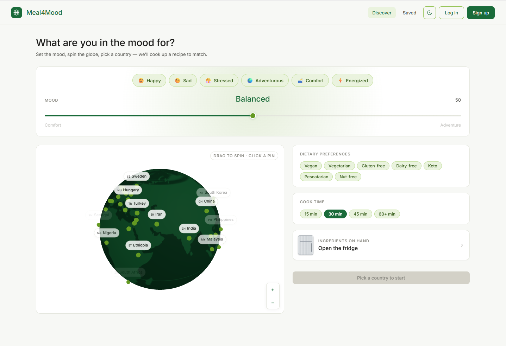
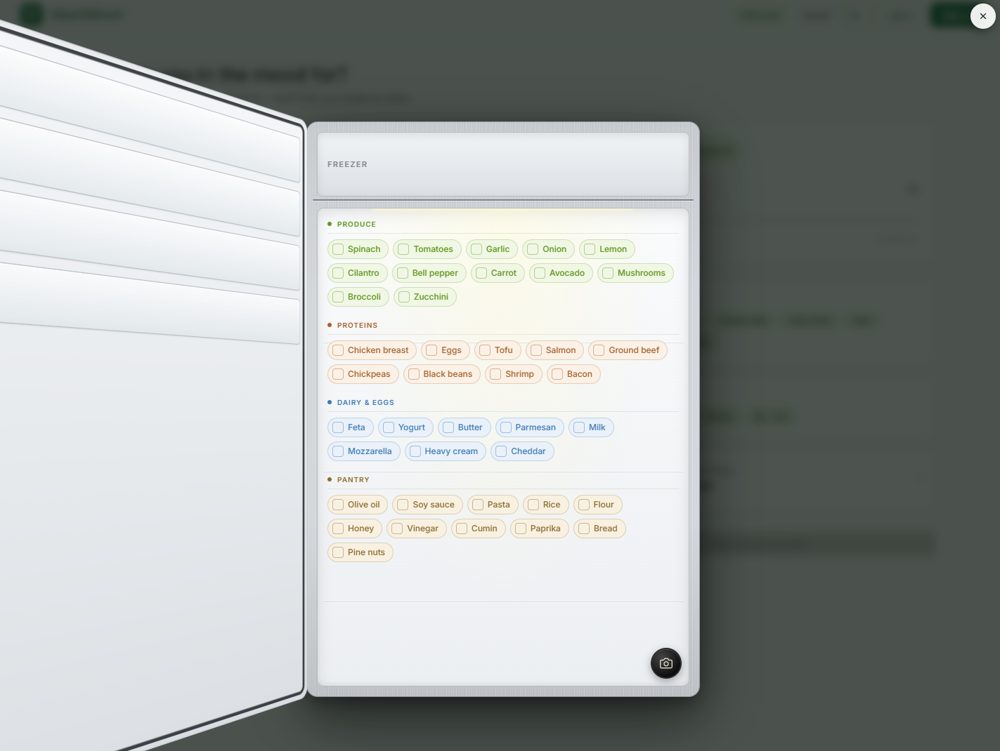

# Meal4Mood

An AI-powered recipe web app that recommends personalized recipes based on your mood, the cuisine you pick from a 3D globe, your dietary preferences, your cook time, and the ingredients in your fridge.

---

## Screenshots

| Set the mood, spin the globe | Scan or pick your ingredients |
| --- | --- |
|  |  |

---

## Team

| Name | Role |
| --- | --- |
| **Nhat Pham** | Project Manager / Developer |
| **Quan Cao** | Business Analyst / QA |

---

## ⚠️ Runtime status

**This submission does not run as-is.** The external services that power the app have been deactivated to avoid lingering API costs:

- **AI API key** is deactivated — recipe generation and the fridge photo scanner will return 500.
- **Supabase project** is paused — sign-up, login, saving and loading recipes will fail.
- **Pexels API key** is removed — recipe images will fall back to placeholder URLs.

To run the app locally, a reviewer needs to provision their own credentials in `.env.local`:

```
ANTHROPIC_API_KEY=...
PEXELS_API_KEY=...
NEXT_PUBLIC_SUPABASE_URL=...
NEXT_PUBLIC_SUPABASE_ANON_KEY=...
```

Then:

```bash
npm install
npm run dev
```

The app will run on `http://localhost:3000`.

---

## Tech stack

- **Next.js 16** (App Router) + **React 19** + **TypeScript**
- **Tailwind CSS v4**
- **Three.js** + **React Three Fiber** — 3D globe for cuisine selection
- **Framer Motion** — transitions and UI animations
- **AI language + vision model** — recipe generation + fridge photo vision
- **Pexels API** — food photography per recipe
- **Supabase** — auth (email/password) + PostgreSQL (saved recipes)

---

## Features

Every feature below is built, wired up, and was working end-to-end before the external services were deactivated.

### Core flow

- **Mood slider** — 0–100 scale with descriptive presets that change as you slide: *Cozy → Soothing → Mellow → Steady → Balanced → Lively → Bold → Daring → Wild → Unhinged*. The selected word styles itself (italics, weight, glow) to match its vibe.
- **3D interactive globe** — 50 country pins on a textured globe you can drag to spin. Click a pin to open a confirmation card showing the cuisine and three signature dishes from that country.
- **Country confirmation card** — Animated preview before generating, with a dismiss option so you can keep exploring.
- **Dietary preferences** — Multi-select chips for Vegetarian, Vegan, Dairy-Free, Gluten-Free, Keto, or None.
- **Cook time selector** — 15 / 30 / 45 / 60+ minute buckets.
- **Fridge ingredient picker** — Type or pick ingredients you already have on hand. The AI uses them as a soft preference, not a hard constraint.
- **Fridge photo scanner** — Snap a picture of your fridge or pantry and an AI vision model returns a structured list of ingredients you can add to your selection in one click.
- **AI recipe generation** — Sends mood + country + cuisine + signature dishes + diet + cook time + ingredients to the AI model. Returns a structured JSON recipe (title, description, cook time, servings, ingredients, steps). Has a JSON-parse retry on the first failure.
- **Food photo lookup** — Searches Pexels with three progressively broader queries (dish-specific → cuisine-level → generic plated food) and falls back to a placeholder if nothing matches.
- **Recipe card** — Clean display of the generated recipe with the matched photo, country flag, mood badge, ingredient list, and numbered steps.

### Account + saved recipes

- **Email/password auth** via Supabase, with a `useAuth` hook that listens for session changes.
- **Save recipes** to Supabase, scoped per-user via row-level security (`user_id = auth.uid()`).
- **Saved recipes page** at `/saved` — grid layout, expand to view, per-card delete with animated removal.

### Polish

- **Dark mode** with a `useTheme` hook and localStorage persistence.
- **Quick pick ticker** on the home page — a scrolling row of suggested mood + cuisine combos for users who don't want to fiddle with the controls.
- **Nearby restaurants by cuisine** — Uses browser geolocation to surface real restaurants matching the generated recipe's cuisine, sorted by distance.

---

## File structure

```
src/
  app/
    api/
      generate-recipe/   # AI recipe generation + Pexels image lookup
      scan-fridge/       # AI vision fridge/pantry photo analysis
      recipes/           # CRUD for saved recipes (Supabase, auth-gated)
    login/               # Login page
    signup/              # Signup page
    saved/               # Saved recipes page
    page.tsx             # Main app — mood, globe, selectors, recipe output
    layout.tsx           # Root layout
  components/
    Globe.tsx            # Three.js 3D globe with 50 country pins
    MoodSlider.tsx       # Mood slider with descriptive presets
    CountryConfirmCard.tsx
    DietarySelector.tsx
    CookTimeSelector.tsx
    FridgeSelector.tsx
    FridgeScanner.tsx
    RecipeCard.tsx
    RecipeSkeleton.tsx
    SavedCard.tsx
    Navbar.tsx
    QuickPickTicker.tsx
    NearbyRestaurants.tsx
    LogoMark.tsx
  lib/
    prompts/             # Recipe + fridge-scan prompt builders
    supabase.ts          # Browser Supabase client
    supabase-server.ts   # Server-side Supabase client (SSR auth)
    types.ts             # Shared TypeScript types
  hooks/
    useAuth.ts
    useTheme.ts

workflows/               # Markdown SOPs documenting each major feature
tools/                   # Utility scripts (data transforms, seeding)
public/                  # Logo, icons, favicons
country-cuisine-map.json # Country → cuisine + flag + signature dishes
```

---

## Build journey

The project came together in a deliberate order so each layer had something real to lean on:

1. **Phase 1 — Market research.** Validated the idea: people genuinely want a recipe app that meets them where their mood is, not just what's in the fridge.
2. **Phase 2 — Mood slider first.** Built the emotional anchor of the app: the slider that turns a feeling into a parameter. The descriptive word presets (Cozy → Unhinged) and the styling-per-mood came out of wanting the UI itself to feel the mood you picked.
3. **Phase 2 — Fridge picker and scanner next.** Wired up the ingredient selector and the AI vision photo scanner so by the time generation existed, the AI already had real ingredients to work with.
4. **Phase 2 — 3D globe.** Made cuisine selection feel like exploration instead of a dropdown. Started with a handful of countries, expanded to 50 with proper flags, lat/lon coordinates, and signature dish lists.
5. **Phase 2 — Recipe generation pipeline.** Connected the AI generation route with structured JSON output and a retry on parse failures. Layered Pexels image lookup with a three-tier query fallback so every recipe gets a believable photo. Closed the loop with Supabase saves so users could keep a personal recipe collection.
6. **Final polish.** Dark mode, the quick-pick ticker for users who want one-tap inspiration, and the nearby-restaurants feature that turns a recipe idea into "or just go out tonight."

---

## License

Released under the [MIT License](LICENSE). © 2026 Nhat Pham and Quan Cao.
